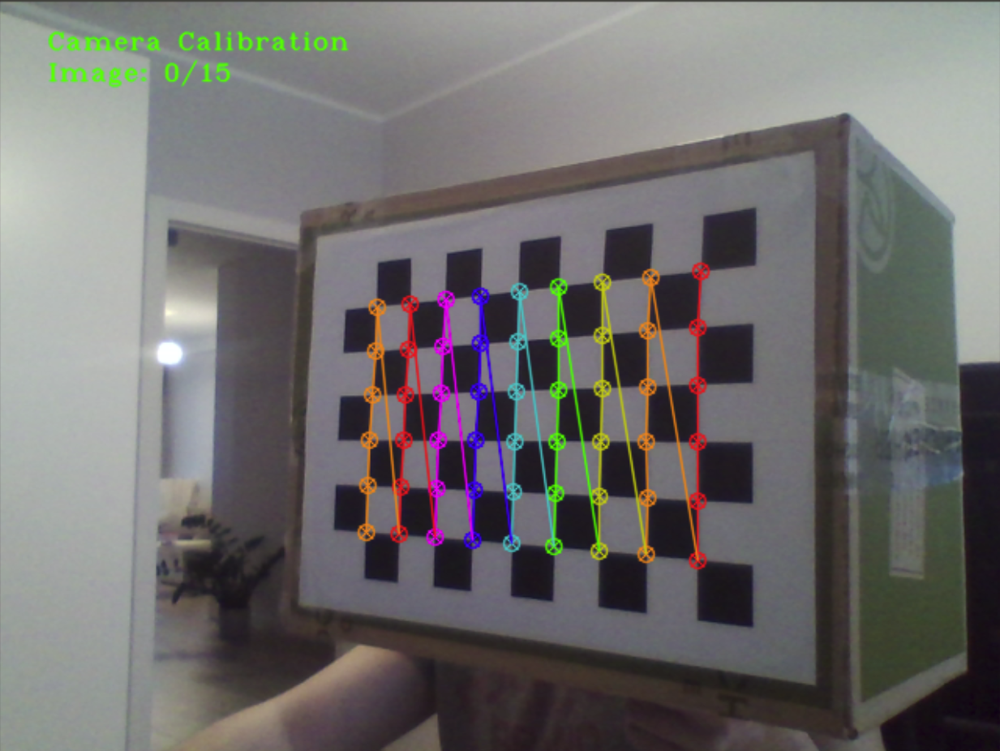
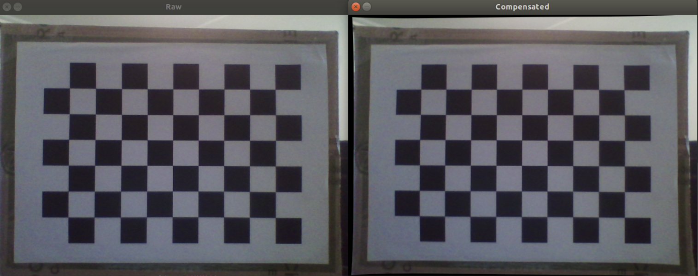

# A Camera class with calibration procedure (openCV), tested with gtest

This class was created to simplify the process of
camera distortions calibration and its usage in DIY projects.
It allows for caliobration (with chessboard), loading of calibration data
and its usage.

## Dependencies:
Camera class depends from [openCV](https://opencv.org/) and [gtest](https://github.com/google/googletest).

## Camera calibration procedure
<p align="center">
  
  <br>Calibration procedure
</p>

* In main.cpp file set data fro yout camera and [chessboard](https://docs.opencv.org/master/pattern.png):
  - camera id
  - name for camera calibration file (it will be created)
  - chessboard dimensions (in horizontal view)
  - chessboard single square side dimension [m]
  - number of images to perform camera calibration (you shuld use at least 15)
* Uncomment line with CAM_CALIBRATE definition
* Compile and run code. The number of current image and total images to acquire is shown in top left corner of
the camera window. After getting all of images the calibration procesure starts automatically.

```c++
#define CAM_CALIBRATE
int main()
{
#ifndef RUN_TESTS
    camera_ns::Camera cam;
    cam.set_video_source(0);
    cam.set_camera_calibration_results_file_name("cam_calib.txt");
#ifdef CAM_CALIBRATE
    cam.set_chessboard_dimensions(6,9);
    cam.set_chessboard_square_dimension(0.0268f);
    cam.set_number_of_images_to_calibrate(15);
    try {
        cam.calibrate();
    } catch (camera_ns::ExceptionMessage ex) {
        std::cout << ex.msg << std::endl;
    }
    // ...
}
```
## Camera - normal usage after calibration
<p align="center">
  
  <br>Calibration results
</p>

* In main.cpp comment line with CAM_CALIBRATE definition
* Choose the calibration algorithm: undistort or remap
* Compile and run program
* It should load data from calibration file created in calibration stage
* The raw and calibrated windows shouls appers

```c++
//...
if(cam.get_calibrated() == false) {
    try {
        cam.load_camera_calibration_data();
    } catch (camera_ns::ExceptionMessage ex) {
        std::cout << ex.msg << std::endl;
    }
}
while (true) {
    try {
        cam.read();
        cam.show_frame_raw();
        cam.compensate_distortions(camera_ns::CorrectionType::undistort);
        cam.show_frame_compensated();
    } catch (camera_ns::ExceptionMessage ex) {
        std::cout << ex.msg << std::endl;
    }
    cv::waitKey(10);
}
/...
```

## Features
* gtest - in order to run google test uncomment the line with #define RUN_TESTS
* exceptions - namespace camera_ns contaings definition of exception thrown by camera class.


## License
The contents of this repository are covered under the [MIT License](./LICENSE.txt)


## Contributing

1. Fork it (<https://github.com/michLab/project_5_home_service_robot.git>)
2. Create your feature branch (`git checkout -b feature/fooBar`)
3. Commit your changes (`git commit -am 'Add some fooBar'`)
4. Push to the branch (`git push origin feature/fooBar`)
5. Create a new Pull Request
